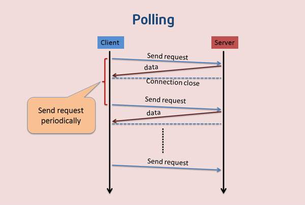
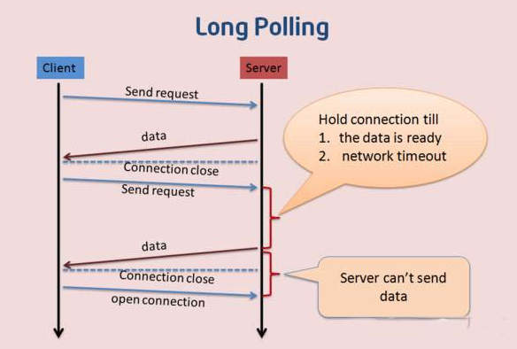

### websoket 学习笔记

## HTTP 的架构模式

- HTTP 是客户端/服务端模式请求中-响应所用的协议，这种模式中 web 浏览器在服务端提交 http 请求，服务端响应数据

## HTTP 的特点

- 半双工协议，也就是在同一时刻数据只能单向流动，客户端向服务端发送请求（单向），服务端响应请求（单向）
- 服务端不能主动推送给我们的服务端；

## 双向通信

- Comet 是一种 web 推送的技术，能使我们的实时信息传送到客户端，无需客户端发起请求，目前由三种方式
- 1）轮询（polling）pou ling
- 2）长轮询（long-lolling）
- 3）iframe 流 （streaming）si dui mei
  

## 一、轮询

- 1）轮询是客户端和服务端之间会一直进行连接，每隔一段时间就轮询一次
- 2）这种方式连接数会很多，一个接收，一个发送，每次请求都会带有 http 的 Header，耗费流量，也会消耗 cpu 的的利用率；

## 二、长轮询

- 1）长轮询是对轮询的改进版，客户端发送 HTTP 给服务器之后，看有没有新消息，如果没有新消息，就一直等等；
- 2）当由新数据的时候，才会返回给客户端。在某种程度上减小了网络带宽和 cpu 利用率。
- 3）由于 HTTP 数据包的头部数据量往往很多，通常由 400 多哥字节，但是真正被服务器需要的数据却很少，有时只有 10k 左右的字节，这样的数据包在网络上周期性的传输，难免对网络带宽是一种浪费。
  

## iframe 流

- 通过在 HTML 页面嵌入一个隐藏的 ifram,然后将这个 iframe 的 src 属性设为一个长连接的请求，服务器端就能源源不断的往客户端推送数据

## EventSource 流

- HTML5 规范中提供了服务端时间 EventSource，浏览器在实现该模范的前提下创建一个 EventSource 连接后，便可以收到服务端发送的消息，这些消息需要遵循一定的格式，对于前端开发人员而言，只需要在浏览器中监听对应的时间皆可；
- SSE 简单模型是：一个客户端去从服务端订阅一条流，之后服务端可以发送消息给客户端，直到服务端或者客户端关闭该“流”，所以 EventSource 也叫做“server-sent-enevt”
- EventSource 流的实现方式对客户端开发人员简单，兼容性好；
- 对应服务端，它可以兼容老的浏览器，无需 upgrade 为其他协议，在简单的服务器推送的场景下可以满足需求；

### 浏览器端

-浏览器端，需要创建一个 EventSource 对象，并且传入一个服务端的接口 URI 作为参 -默认 EventSource 对象通过侦听 message 事件获取服务端传来的消息
-open 事件则在 http 连接建立后触发
-error 事件会在通信错误（连接中断、服务端返回数据失败）的情况下触发 -同时 EventSource 规范允许服务端指定自定义事件，客户端侦听该事件即可

### 服务端

- 事件流的对应 MIME 格式为 text/event-stream，而且其基于 HTTP 长连接。针对 HTTP1.1 规范默认采用长连接，针对 HTTP1.0 的服务器需要特殊设置。
- event-source 必须编码成 utf-8 的格式，消息的每个字段使用"\n"来做分割，并且需要下面 4 个规范定义好的字段
- Event: 事件类型
- Data: 发送的数据
- ID: 每一条事件流的 ID
- Retry： 告知浏览器在所有的连接丢失之后重新开启新的连接等待的时间，在自动重新连接的过程中，之前收到的最后一个事件流 ID 会被发送到服务端

3.2、缺点
因为是服务器->客户端的，所以它不能处理客户端请求流
因为是明确指定用于传输UTF-8数据的，所以对于传输二进制流是低效率的，即使你转为base64的话，反而增加带宽的负载，得不偿失。
